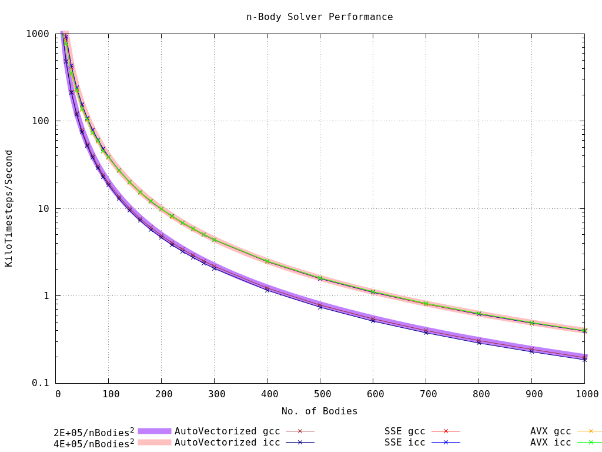
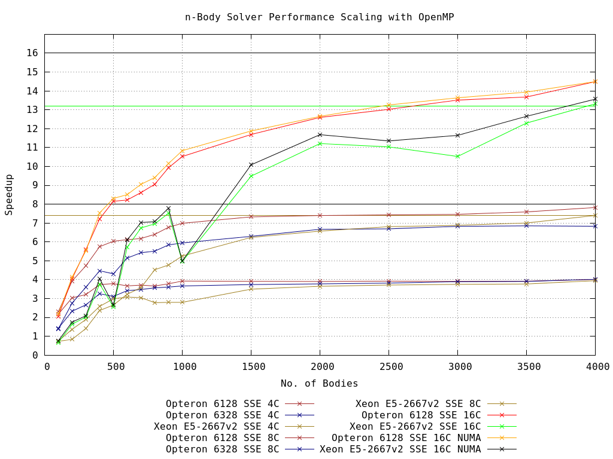

# nbody
n-body solver, with the aim of writing a fast MPI implementation.

For the n-body problem this is a little non-trivial since each timestep the position of every body is needed, so it is something of a communication-heavy problem. Cluster available for testing has only a Gigabit Ethernet interconnect, so efficient communication will be essential.

For each pair of bodies, we need to compute Fij = G\*mi\*mj\*(ri-rj)/|ri-rj|^3. Since the forces are equal and opposite, we only have to compute the upper triangle of this matrix. The forces give us acceleration values, which we use to update the velocity and position using a simple Euler integration.

For n bodies, then, we need to perform n\*(n/2) force calculations. We expect performance measured in "Timesteps/Second" to scale in this way.

### Serial Implementation
Body position, velocity, acceleration and mass are each stored in separate arrays rather than a somewhat neater struct-based approach, to make it easier for the auto-vectorizer and to use manual vector intrinsics.

#### Manual Vectorization
Compute accelerations for 2, 4 body pairs at a time (double precision, SSE, AVX) in inner loop of `ComputeAccel`, routine called `ComputeAccelVec`. This is twice as fast as the autovectorized version using SSE, but only slightly faster than this with AVX!

The reason for this is possibly that the inner loop of `ComputeAccelVec` includes the instructions (V)SQRTPD and (V)DIVPD. These are very high latency instructions which account for 67% of the loop's total cycles. On Intel chips, the AVX instruction has twice the latency of the corresponding SSE instruction, so is no faster. On AMD's Piledriver, the latencies for VSQRTPD and VDIVPD are only 1.93 and 1.8 times longer, respectively. These instructions should execute ~15% faster Piledriver with AVX, then, and actually this is more or less the performance improvement that we see, even though this is only 67% of the loop.

Additionally, these instructions on Intel Ivy-Bridge CPUs have only 64% of the latency compared to Sandy-Bridge. We see that the 4GHz E5-2667v2 (Ivy-Bridge) is significantly faster than the 4.4GHz i5-2500K (Sandy-Bridge).

The Opteron 6128 system is what we will use for MPI testing across multiple nodes.

### OpenMP
Before starting with MPI, we can check how OpenMP code scales with core-count. This gives us something to aim for when running an MPI implementation on a shared memory system. Accounting for the difference in turbo-boost clocks between a single and 4-thread load (i5-2500K) the optimal speedup is 3.82x.

For best performance the OpenMP scheduling needs to be set properly. Since we are only computing the upper triangle of the force matrix, later loops are much faster since they have less work to do. For this reason, we choose `static` scheduling with as small a "chunk-size" as possible (but no smaller than 8, we don't want to induce cache misses and false sharing by making chunks smaller than one cache line).

For large numbers of bodies scaling is very good, with most configurations reaching 90% optimal scaling after around 250 particles/thread. Note there is no 16C result plotted for the Opteron 6328 -- these CPUs have only a single FPU per pair of cores, so the system does not scale at all above 8C.

Also, at the maximum core counts, we benefit from making NUMA-friendly memory allocations, achieved here simply by parallelising the initialization routine to expolit the "first touch" policy used by the Linux OS.

On a shared memory system, then, we expect a good MPI implementation also to achieve near-optimal scaling with core count for large numbers of bodies.
